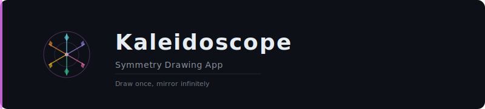

<p align="center">
  
</p>

# Kaleidoscope

A minimalist Android drawing app that creates mesmerizing symmetrical patterns with real-time kaleidoscope effects.

## Features

- **Radial Symmetry Drawing** - Draw once, see your strokes mirrored across multiple axes (2-9 pairs)
- **Dynamic Color Shifting** - Colors smoothly shift as you draw, creating gradient effects
- **Adjustable Brush Size** - Fine-tune your strokes from thin lines to bold marks
- **Save to Gallery** - Export your creations as PNG images
- **Dark Theme** - Easy on the eyes with a modern dark interface
- **Edge-to-Edge Display** - Immersive full-screen drawing experience

## Screenshots

| Drawing | Controls |
|---------|----------|
| Create symmetrical art with touch | Adjust brush size and symmetry pairs |

## How It Works

1. Touch and drag anywhere on the canvas to draw
2. Your strokes are automatically mirrored based on the symmetry setting
3. Tap the color button (bottom right) to change colors
4. Adjust **Brush** slider to change stroke thickness
5. Adjust **Pair** slider to change number of symmetry reflections
6. Tap **Save** to export to your gallery
7. Tap **X** to clear and start fresh (background color changes too)

## Tech Stack

- **Kotlin** - 100% Kotlin codebase
- **Jetpack Compose** - Modern declarative UI
- **Material 3** - Latest Material Design components
- **Canvas API** - Custom drawing with Compose Canvas
- **ViewModel** - MVVM architecture for state management

## Requirements

- Android 9.0 (API 28) or higher
- ~25 MB storage

## Installation

### From Release
1. Download the latest APK from [Releases](../../releases)
2. Enable "Install from unknown sources" if prompted
3. Install and enjoy

### Build from Source
```bash
git clone https://github.com/sunil-dhaka/Kaleidoscope.git
cd Kaleidoscope
./gradlew assembleDebug
```

## Project Structure

```
app/src/main/java/com/example/kaleidoscope/
    MainActivity.kt          # Entry point, theme setup
    KaleidoscopeScreen.kt    # Main UI composable
    KaleidoscopeViewModel.kt # State management, drawing logic
    ui/theme/                # Material 3 theming
```

## License

MIT License - feel free to use, modify, and distribute.

## Author

Built with Jetpack Compose by [sunil-dhaka](https://github.com/sunil-dhaka)
